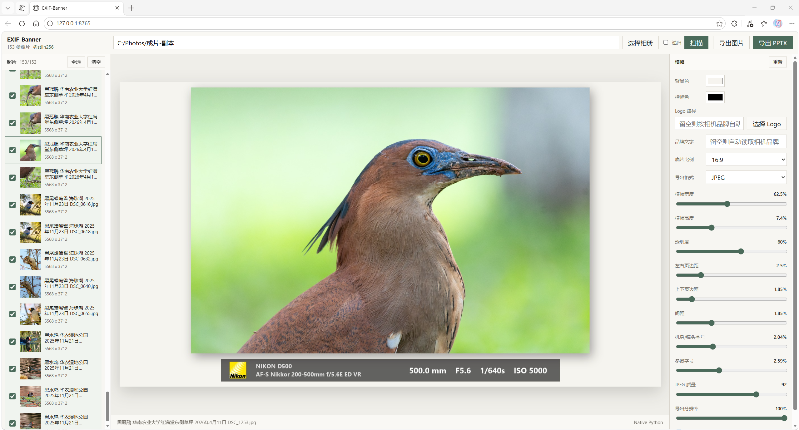

# EXIF-Banner

[English](README_EN.MD)

EXIF-Banner 是一个本地运行的照片参数横幅生成工具。它用浏览器作为交互界面，扫描本地相册，读取照片 EXIF 信息，并批量导出带拍摄参数横幅的图片或 PPTX。

作者：[@stlin256](https://github.com/stlin256/EXIF-Banner)

## 示例

编辑界面：



示例图片：


## 特性

- 本地运行，不上传照片或 EXIF 数据。
- 浏览器交互，支持选择相册、手动选择 Logo、实时预览横幅。
- 原生读取常见 EXIF 信息，并在可用时使用 ExifTool 补充更完整的数据。
- 支持相机型号、镜头型号、焦距、光圈、快门、ISO 等参数展示。
- 支持按相机品牌自动匹配内置 Logo；未匹配到品牌时会提示手动加载 Logo。
- 支持缓存设置和 Logo 路径，下次打开不用重新配置。
- 支持鼠标滚轮翻页、键盘翻页、后台持续预渲染和预览缓存。
- 支持更清晰的加载动画和导出进度条。
- 支持导出 JPEG / PNG 合成图片。
- 支持按原图像素比例导出，`100%` 以导入照片分辨率为基准。
- 支持递归相册导出，并保留源目录结构。
- 支持导出 PPTX，每张照片对应一页。

## 安装

需要 Python 3.10 或更新版本。

```powershell
pip install -r requirements.txt
```

## 启动

```powershell
python webapp\server.py
```

Windows 也可以双击：

```text
start-web.bat
```

默认地址：

```text
http://127.0.0.1:8765/
```

## 使用流程

1. 点击「选择相册」，选择本地照片文件夹。
2. 如需扫描子文件夹，勾选「递归」。
3. 点击「扫描」。
4. 在右侧工具区调整背景、Logo、底片比例、横幅尺寸、字体、页边距、导出格式、JPEG 质量和导出分辨率。Logo 路径留空时会按相机品牌自动匹配内置 Logo。
5. 在左侧勾选要导出的照片。
6. 点击「导出图片」或「导出 PPTX」，再选择目标目录。

## Logo 自动匹配

EXIF-Banner 内置了常见品牌 Logo，并会根据照片 EXIF 中的 `Make` / `Model` 自动匹配：

```text
SONY / NIKON / OLYMPUS / CANON / PENTAX / PANASONIC / RICOH
```

内置 Logo 文件位于：

```text
webapp/logos/
```

匹配规则位于：

```text
webapp/logos/logo-rules.json
```

扩展新品牌时，把 Logo 图片放入 `webapp/logos/`，再在 `logo-rules.json` 中添加一条规则即可。手动选择的 Logo 会优先于自动匹配；如果没有匹配到当前照片品牌，页面会弹出提示，提醒手动加载 Logo。

## 导出说明

### 图片

- JPEG 是默认格式，速度快、体积小，适合照片类输出。
- PNG 是无损格式，体积更大，导出更慢，适合需要无损保存的场景。
- 导出分辨率使用照片像素作为基准：`100%` 表示照片区域不降采样，`90%` 表示照片区域缩到原图像素的 90%。

### PPTX

PPTX 由 `python-pptx` 生成，不再手写 PowerPoint 包结构。每页会放入一张已经合成好的横幅图片，便于直接演示或继续编辑页面顺序。

## 预览体验

预览区支持鼠标滚轮和键盘翻页。后台会根据最近的翻页方向持续预渲染附近照片，并缓存已经生成的预览；快速浏览时，如果预览已命中缓存，会立即切换显示。扫描、加载和导出时会显示快门式加载动画，导出任务会显示进度条。

## EXIF 读取

EXIF-Banner 会优先使用内置的 Python 解析能力读取基础 EXIF。若检测到 ExifTool，会用它补充更完整的镜头和厂商信息。

ExifTool 查找顺序：

1. `EXIFTOOL_PATH` 环境变量
2. 当前相册目录下的 `exiftool.exe`
3. 仓库内 `tools/exiftool/exiftool.exe`
4. 系统 `PATH` 中的 `exiftool` 或 `exiftool.exe`

ExifTool 不是必需依赖；没有 ExifTool 时，工具仍会尝试使用 Python 原生解析。

## 项目结构

```text
webapp/               本地 Web 应用
webapp/server.py      后端服务、EXIF 解析、渲染和导出
webapp/static/        前端页面、样式和交互脚本
webapp/logos/         内置品牌 Logo 与匹配规则
tools/                可选工具脚本
images/               README 示例图片
requirements.txt      Python 依赖
start-web.bat         Windows 启动脚本
```

## 隐私

EXIF-Banner 面向本地工作流设计。照片扫描、横幅渲染、图片导出和 PPTX 导出都在本机完成，不会把照片或路径上传到第三方服务。
